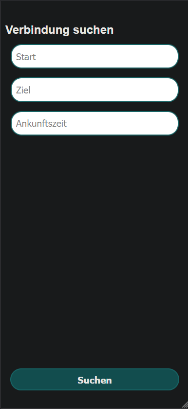

## DB Navigator App Reimplementation

### About
This project is the result of the reverse engineered *DB Navigator* App by *Deutsche Bahn AG*. It was developed to make navigation in Germany easier for seniors and the visually impaired. Only the most important functions are included and unnecessary graphics and animations have been removed. The font size is dynamic.

### Showcase

### Built with
The project is fully built with standard web technology (HTML, CSS, JavaScript). For fetching the current information it uses the `v5.db.transport.rest` API.

### Features
- Dynamic font size
- Design: Black on white
- Stations autocompletion
